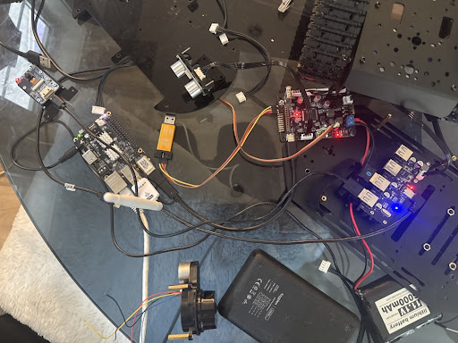
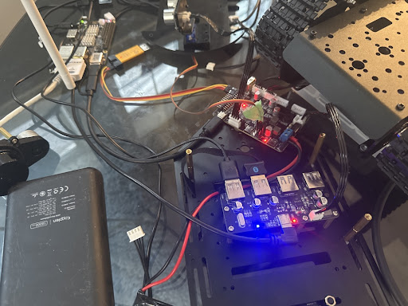

# Rock64 hardware interface check — 2026-08-17

## Result

The Rock64 can see the Bluetooth adapter and the two USB serial devices. It does
not currently see a Wi-Fi adapter or a Linux wireless interface. The HC-SR04
and SG90 cannot be enumerated by USB: they are electrical GPIO/PWM devices, so
their status depends on controller firmware and wiring.

| Item | Evidence | Result |
|---|---|---|
| Bluetooth adapter | USB `33fa:0001 USB2.0-BT`, `btusb`, `hci0`, powered on | **Detected** |
| Bluetooth peer | `DualSense Wireless Controller`: paired, trusted, and connected | **Detected/paired/connected** |
| STM32 controller link | `1a86:55d4`, `/dev/rock64_stm32 -> /dev/ttyACM0` | **Detected** |
| Espressif USB device | `303a:1001`, `/dev/ttyACM1`, CDC ACM | **Detected** |
| Wi-Fi adapter | No `148f:7601` MT7601 device; no `148f:2878` virtual-CD device | **Not detected** |
| Wi-Fi network interface | Only `eth0` and `lo` exist; no `/sys/class/net/*/wireless` | **Not detected** |
| HC-SR04 | No USB identity; no ultrasonic driver yet, but two existing PWM headers can be repurposed | **Electrically supported; firmware still required** |
| SG90 | No device identity; factory firmware exposes four PWM-servo outputs | **Firmware path exists; physical presence cannot be auto-detected** |

## Live Rock64 evidence

- Host: `rock64`, Linux `6.18.43-current-rockchip64`, address `192.168.1.139`.
- NetworkManager reports only `eth0: ethernet:connected`; Wi-Fi radio is
  enabled, but no Wi-Fi device exists.
- Bluetooth service is active. `bluetoothctl show` reports controller
  `04:7F:0E:7E:65:F8`, `Powered: yes`.
- USB enumeration includes hub `1a86:8091`, Bluetooth `33fa:0001`, STM32/WCH
  serial `1a86:55d4`, and Espressif JTAG/serial `303a:1001`.
- `gpiodetect` and `gpioinfo` are not installed on the Rock64, so no safe
  userspace GPIO-line inspection is currently available.
- `rock64-robot.service` is active, but the ROS graph currently exposes only
  `/parameter_events` and `/rosout`; there is no ultrasonic or servo topic.

## Factory-firmware comparison

The supplied Hiwonder folders were searched:

`C:\Users\ZIXXE\v2tankrobot\rosrobotcontrollerm4_7in1\Hiwonder\Peripherals`

`C:\Users\ZIXXE\v2tankrobot\rosrobotcontrollerm4_7in1\Hiwonder\Portings`

`C:\Users\ZIXXE\v2tankrobot\rosrobotcontrollerm4_7in1\Hiwonder\System`

`C:\Users\ZIXXE\v2tankrobot\rosrobotcontrollerm4_7in1\Hiwonder\USB_HOST`

The factory code contains no `HC-SR04`, ultrasonic, `TRIG`, `ECHO`, or distance
implementation. It does contain:

- Bluetooth enabled in `System\global_conf.h` and DMA traffic on `huart2` in
  `Portings\bluetooth_porting.c`.
- Four PWM-servo objects and GPIO waveform outputs in
  `Portings\pwm_servo_porting.c`.
- PWM servo command handling in `System\packet_handle.c`.

The legacy board labels remain printed on the headers, but the current
production image deliberately overrides their ownership: PA11/J1 is the sole
SG90 output, PA12/J2 is HC-SR04 ECHO, PC8/J4 is HC-SR04 TRIG, and PC9 is
unused. The SG90 command path therefore supports J1 only. A servo has no
electrical identity that Linux can discover.

## Confirmed no-extra-board HC-SR04 wiring

The Hiwonder factory controller schematic maps the four three-pin PWM headers
as follows:

| Board header | STM32 pin | Use in this robot |
|---|---|---|
| J1 | PA11 / `PWM_SERVO_1` | Keep SG90 here |
| J2 | PA12 / `HC_SR04_ECHO` (legacy servo-header label) | HC-SR04 `ECHO` signal |
| J4 | PC8 / `HC_SR04_TRIG` (legacy servo-header label) | HC-SR04 `TRIG` signal |

Use the signal (`S`) contact of J4 for `TRIG` and the signal (`S`) contact of
J2 for `ECHO`. Use the `+5V` and `GND` contacts on either PWM header for the
HC-SR04 power wires; all four PWM headers share ground. The HC-SR04 four-wire
lead therefore needs its wires split across two three-pin headers; it does
not plug into the I2C or SBUS socket.

The STM32F407VET6 datasheet marks PA11, PA12, PC8, and PC9 as FT
(5-V-tolerant) I/O, but the complete board-level input path still needs to be
verified. Use a resistor divider or level shifter unless that exact path is
confirmed safe. The controller must be flashed with the current HC-SR04
image first: PC8/TRIG is an output and PA12/ECHO is a rising/falling EXTI
input using the cycle counter. Do not flash an older image that drives PA12
or PC8 as a servo.

This mapping is cross-checked against Hiwonder's official controller hardware
course, section “4-Lane Servo Port”, and the project's
`firmware/stm32_chassis/RosRobotControllerM4.ioc`.

## Image evidence

The two supplied bench images are preserved here:

They show the Rock64/USB-host area, the red STM32 controller, the blue USB hub,
and the attached wiring. The images support the physical bench context, but
they do not provide enough resolution to prove an HC-SR04 signal pin, a
specific Wi-Fi dongle model, or an SG90 PWM channel.

> **Current production-image correction:** The printed legacy servo labels are
> not the active pin assignment. PA11/J1 is the sole SG90 output; PA12/J2 is
> HC-SR04 ECHO; PC8/J4 is HC-SR04 TRIG; and PC9 is unused. The current image
> configures PA12 as a rising/falling EXTI input, not a servo output or timer
> capture input. Do not flash an older image that drives PA12 or PC8 as a
> servo.

## Next safe actions

1. For Wi-Fi, reseat the adapter on a powered hub or the Rock64 USB 3 host port,
   then rerun `lsusb`, `ip link`, and the repository's
   `deployment/scripts/configure_wifi_adapter.sh` if the adapter is the
   expected MT7601 model.
2. For HC-SR04, use J4/J2 as documented above and inspect the firmware
   capture diagnostics plus the ROS `sensor_msgs/Range` adapter; do not expect
   USB enumeration.
3. For SG90, identify the actual signal/power/ground connector and perform a
   deliberately bounded PWM test only after confirming the linkage and safe
   mechanical travel.
